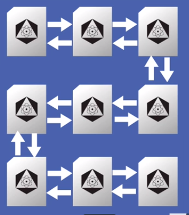

# Data structures with JAVA

> All the data structures can be implemented on other languages

## How Run

- Run `./gradlew build` for build the project
- Run `./gradlew test` for run all unit tests
- Run `gradle wrapper` to generate gradle-wrapper

1. Array
    - Simpler structure, called of inline structure
    - Use indexes for a handle with positions
    - In Java Arrays need to use predetermined positions number
2. LinkedList
   - Data structure which knows what the next element
   - This list we name the Linked List. The difference between it and the Vector is that these elements are
     next to each other in memory, while in the Linked list they are in different places, 
     but one points to the other indicating the next.
   - 
   - Double linked list, it's a way to get more performance on our linked list with a double linked list
    we can get the previous cell too, so we can do operations more easily.
        -  
3. Stack
    - Data structure to store data pushing to the top of the stack or popping the last inserted element;
    - Usually have `push`, `pop`, `peek` methods;
    - A common use case for stacks are the keyboards buffers.
   
## Questions:

Como funciona a inserção em um vetor? Cite dois algoritmos para inserção nela, um que seja rápido e um que seja devagar.

**R:** - Podemos percorrer todo o array adicionando items, forma lenta, ou utilizarmos uma posição incremental para adicionarmos um novo valor baseado nessa posição, que deve ser a ultima

Por que a deleção em um vetor é demorada?

**R:** - Pois precisamos percorrer todo o array e também reorganiza-lo

Por que inserir no meio de um vetor também é demorado?

**R:** - Porque precisamos reorganizar os elementos já presentes no array. Isso também faz com que no pior caso, o tempo seja linear, afinal ele pode precisar passar por todos os elementos.

Quais são as vantagens da lista ligada em relação ao vetor?

**R:** - A vantagem da lista ligada é que como a relação entre duas células é feita por referências, é fácil
inserir um elemento no meio da lista. Inserir no começo e no fim também leva tempo constante, afinal geralmente
a estrutura possui referências para o primeiro e último elemento.

E quais são as desvantagens da lista ligada em relação ao vetor?

**R:** Recuperar um elemento em uma posição aleatória pode levar tempo linear. Afinal, diferente do vetor
onde pegar um elemento qualquer custa uma simples operação de array, em uma lista ligada, precisamos navegar pelas
referências até encontrar o elemento desejado.

Explique, como funciona a remoção de um elemento que está no meio de uma lista ligada?

**R:** Se o elemento está no meio de um lista, a remoção dele é basicamente acertar a referência `proximo`
do elemento a esquerda e fazê-lo apontar para o próxima de X. Dessa forma, "pulamos" o elemento X
e a lista continua certa.

Comente sobre o tempo de execução da operação de remoção da lista ligada.

**R:** A remoção de uma lista ligada simples leva tempo linear. Afinal, precisamos navegar a lista até achar
o elemento antes e o depois do elemento a ser removido.

Qual a diferença entre uma lista ligada simples e uma lista duplamente ligada?

**R:** Uma lista duplamente ligada aponta para o elemento anterior, 
nos dando uma maior facilidade para exclusão de elementos que estão em posições diversas na nossa lista por exemplo.
Diferente das listas simplesmente ligadas que somente apontam para o próximo elemento.

Como é o tempo de remoção de uma lista duplamente ligada?

**R:** A remoção de uma lista ligada pode ser linear ou constante. Se estivermos com as referências de uma celula que será deletada
o tempo será constante, pois temos os valores de referencia de `proxima celula` e de `celula anterior`, bastando
apenas acertar as referências. Mas se precisarmos procurar pelo elemento item a item na lista, o tempo será linear.

Como funciona uma inserção de um elemento no meio de uma lista duplamente ligada?

**R:** A célula `X` para entrar no meio de uma lista duplamente ligada precisa:

- Pegar a celula `anterior` e marcar o `próximo` dela como `X`;
- Pegar a antiga célula `próximo` da `anterior`, e marcar a anterior dela como `X`;
- Marcar `anterior` de `X` como a antiga `anterior`;
- Marcar `próxima` de `X` como a antiga `próxima`.

Sobre o tempo de execução da inserção no início e no fim de uma lista duplamente ligada.

**R:** Em ambos o tempo é constante. Assim como na lista simplesmente ligada, basta acertar as referências, já
que a estrutura aramzena o primeiro e último nó

O que é uma pilha?

**R:** Uma estrutura de dados para armazenamos valores, empilhando os mesmos e podendo retirar um por um. Sendo uma estrutura
LIFO(Last in first out)

Qual é o tempo de execução das operações de inserir e remover um elemento da pilha?

**R:** Tempo constante pois temos uma lista ligada por debaixo dos panos

Simule as seguintes operações na pilha:

- Insira "Mauricio"
- Insira "Marcelo"
- Remova
- Insira "Guilherme"
- Insira "Paulo"
- Remova
- Insira "João"

Qual o estado atual da pilha?

**R:** ["Mauricio", "Guilherme", "João"]
  