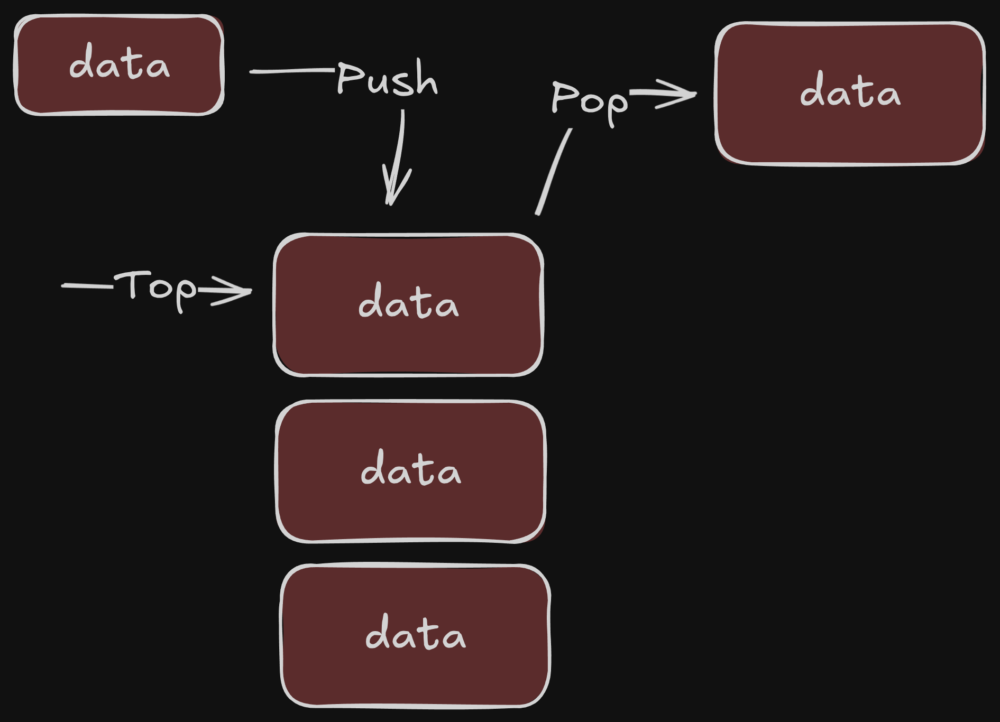

# TypeScript

> Implementing data structures with TypeScript

## Linked lists

A linked list is a sequential list of nodes that hold data which point to other nodes also containing data.

- Data -> Data -> Data -> null

### Where are linked lists used

- Used in many List, Queue and Stack implementations
- Greate for creating circular lists
- Can easily model real world objects such as trains
- Terminology
  - Head: First node in a linked list
  - Tail: Last node in a linked list
  - Pointer: Reference to another node
  - Node: An object containing data and pointers

### Singly vs Doubly linked lists

- Singly linked lists only hold a reference to the next node. In the implementation you always maintain a reference to the head to the linked list and a reference to the tail node for quick additions/removals
  - Data -> Data -> Data -> Data ...
- With a doubly linked list each node holds a reference to the next and previous node. In the implementation you always maintain a reference to the head and the tail of the doubly linked list to do quick additions/removals from both ends of your list
  - Data <-> Data <-> Data <-> ...

### Pros and cons Single and Doubly Linked lists

- Single Linked
  - Pros
    - Use less memory
    - Simpler implementation
  - Cons
    - Cannot easily access previous elements
- Doubly linked
  - Pros
    - Can be traversed backwards
  - Cons
    - Takes 2 times more memory

### Complexity Linked Lists

| Operation        | Single Linked | Double Linked |
| ---------------- | ------------- | ------------- |
| Search           | O(n)          | O(n)          |
| Insert at head   | O(1)          | O(1)          |
| Insert at tail   | O(1)          | O(1)          |
| Remove at head   | O(1)          | O(1)          |
| Remove at tail   | O(n)          | O(1)          |
| Remove in middle | O(n)          | O(n)          |

## Stack

### What is a Stack?

A stack is a one-ended linear data structure which models a real world stack by having two primary operations, namely **push** and **pop**.

LIFO - Last In First Out

### When and where is a Stack used?

- Used by undo mechanisms in text editors
- Used by compiler syntax checking for matchin brackets and braces
- Can be used to model a pile of book plates
- Used behind the scenes to support recursion by keeping track of previous function calls
- Can be used to do a Depth First Search (DFS) on a graph

### Example - Brackets

Problem: Given a string made of the following brackets: ()[]{}, determine whether the brackets properly match.

- [{}] -> Valid
- (()()) -> Valid
- {] -> Invalid
- [()]))() -> Invalid
- []{}({}) -> Valid

Bracket sequence:

- [[{}]()]
  - [
  - [[
  - [[{
  - [[{} -> Removes {} Matched
  - [[] -> Removes [] Matched
  - [(
  - [() -> Removes () Matched
  - [] -> Removes [] Matched
  - Check if stack is empty
  - Structure is valid
