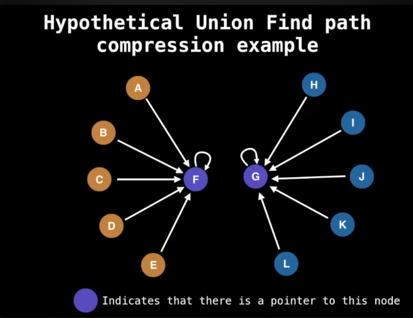
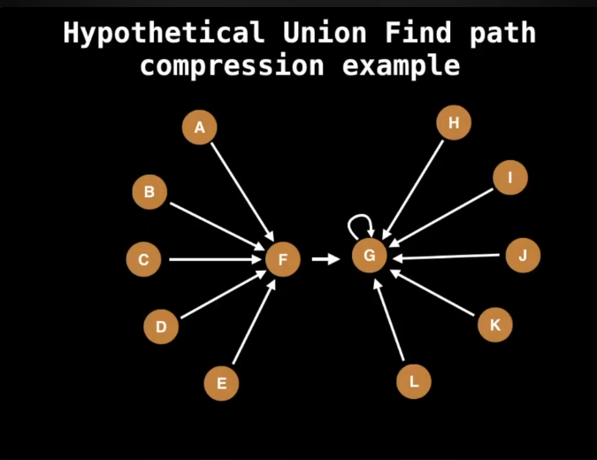

# TypeScript

> Implementing data structures with TypeScript

- [Data Structures From William Fiset](https://github.com/williamfiset/DEPRECATED-data-structures/tree/master)

## Resume

| Array                                                                    | Linked List                                                             |
| ------------------------------------------------------------------------ | ----------------------------------------------------------------------- |
| Size of array is fixed                                                   | Size of a list is not fixed                                             |
| Memory is allocated from stack                                           | Memory is allocated from heap                                           |
| It is necessary to specify the number of elements during the declaration | It's not necessary to specify the number of elements during declaration |
| It occupies less memory thant linked list                                | Occupies more memory                                                    |

| Stack                                                        | Queue                                                        |
| ------------------------------------------------------------ | ------------------------------------------------------------ |
| Follows **LIFO** (Last In, First Out) order                  | Follows **FIFO** (First In, First Out) order                 |
| Insertion and deletion happen at the **same end** (top)      | Insertion happens at **rear**, deletion happens at **front** |
| Example operations: `push()`, `pop()`                        | Example operations: `enqueue()`, `dequeue()`                 |
| Used in function calls, undo features, expression evaluation | Used in scheduling, buffering, and task management           |

| Queue                                          | Deque (Double-Ended Queue)                             |
| ---------------------------------------------- | ------------------------------------------------------ |
| Insertion at rear and deletion at front only   | Insertion and deletion allowed at **both ends**        |
| Supports only one type of removal and addition | More flexible — can act as both **stack and queue**    |
| Easier to implement, simpler structure         | Slightly more complex implementation                   |
| Examples: task scheduling, printer queue       | Examples: palindrome checking, sliding window problems |

| Stack Memory                              | Heap Memory                                                   |
| ----------------------------------------- | ------------------------------------------------------------- |
| Memory is allocated **automatically**     | Memory is allocated **manually or dynamically**               |
| Size is usually **limited and fixed**     | Size can grow or shrink dynamically                           |
| Stores local variables and function calls | Stores dynamically allocated data (e.g., via `new`, `malloc`) |
| Faster access                             | Slower access due to fragmentation and management overhead    |

| Tree                                                         | Graph                                                         |
| ------------------------------------------------------------ | ------------------------------------------------------------- |
| A **hierarchical** structure with parent-child relationships | A **network** structure — connections can be in any direction |
| Has **one root** and no cycles                               | Can have **multiple roots** and **cycles**                    |
| Example: binary tree, BST, AVL tree                          | Example: social networks, road maps                           |
| Edges are **directed from parent to child**                  | Edges can be **directed or undirected**                       |

| Binary Tree                              | Binary Search Tree (BST)                         |
| ---------------------------------------- | ------------------------------------------------ |
| Each node has at most two children       | Each node follows: left < root < right           |
| No specific ordering among nodes         | Maintains **sorted order**                       |
| Used for general hierarchical structures | Used for **fast searching, insertion, deletion** |
| Example: expression tree                 | Example: database indexing                       |

## Linked lists

A linked list is a sequential list of nodes that hold data which point to other nodes also containing data.

- Data -> Data -> Data -> null

### Where are linked lists used

- Used in many List, Queue and Stack implementations
- Greate for creating circular lists
- Can easily model real world objects such as trains
- Terminology
  - Head: First node in a linked list
  - Tail: Last node in a linked list
  - Pointer: Reference to another node
  - Node: An object containing data and pointers

### Singly vs Doubly linked lists

- Singly linked lists only hold a reference to the next node. In the implementation you always maintain a reference to the head to the linked list and a reference to the tail node for quick additions/removals
  - Data -> Data -> Data -> Data ...
- With a doubly linked list each node holds a reference to the next and previous node. In the implementation you always maintain a reference to the head and the tail of the doubly linked list to do quick additions/removals from both ends of your list
  - Data <-> Data <-> Data <-> ...

### Pros and cons Single and Doubly Linked lists

- Single Linked
  - Pros
    - Use less memory
    - Simpler implementation
  - Cons
    - Cannot easily access previous elements
- Doubly linked
  - Pros
    - Can be traversed backwards
  - Cons
    - Takes 2 times more memory

### Complexity Linked Lists

| Operation        | Single Linked | Double Linked |
| ---------------- | ------------- | ------------- |
| Search           | O(n)          | O(n)          |
| Insert at head   | O(1)          | O(1)          |
| Insert at tail   | O(1)          | O(1)          |
| Remove at head   | O(1)          | O(1)          |
| Remove at tail   | O(n)          | O(1)          |
| Remove in middle | O(n)          | O(n)          |

## Stack

### What is a Stack?

A stack is a one-ended linear data structure which models a real world stack by having two primary operations, namely **push** and **pop**.

LIFO - Last In First Out


### When and where is a Stack used?

- Used by undo mechanisms in text editors
- Used by compiler syntax checking for matchin brackets and braces
- Can be used to model a pile of book plates
- Used behind the scenes to support recursion by keeping track of previous function calls
- Can be used to do a Depth First Search (DFS) on a graph

### Example - Brackets

Problem: Given a string made of the following brackets: ()[]{}, determine whether the brackets properly match.

- [{}] -> Valid
- (()()) -> Valid
- {] -> Invalid
- [()]))() -> Invalid
- []{}({}) -> Valid

Bracket sequence:

- [[{}]()]
  - [
  - [[
  - [[{
  - [[{} -> Removes {} Matched
  - [[] -> Removes [] Matched
  - [(
  - [() -> Removes () Matched
  - [] -> Removes [] Matched
  - Check if stack is empty
  - Structure is valid

## Queue

### What is a queue?

A queue is a linear data structure which models real world queues by having two primary operations, namely **enqueue** and **dequeue**.


### When and where is a queue used?

- Any waiting line models a queue, for example a lineup at a movie theatre
- Can be used to efficiently keep track of the x most recently added elements
- Web server request management where you want first come first serve
- Breadth first search (BFS) graph transversal

### Complexity

| Operation | Queue |
| --------- | ----- |
| Enqueue   | O(1)  |
| Dequeue   | O(1)  |
| Peeking   | O(1)  |
| Contains  | O(n)  |
| Removal   | O(n)  |
| Is empty  | O(1)  |

### Queue example - BFS


### Pseudo code of BFS

```
Let Q be a Queue
Q.enqueue(starting_node)
starting_node.visited = true

While Q is not empty Do
  node = Q.dequeue()

  For neighbour in neighbours(node):
    If neighbour has not been visited:
      neighbour.bisited = true
      Q.enqueue(neighbour)
```

## Priority Queues (PQs)

### What is a priority queue?

- Is a abstract data type that operates similar to a normal queue except that **each element has a certain priority**.
- The priority of the elements in the priority queue determine the order in which elements are removed from the PQ

### What is a Heap?

- A heap is a tree based DS that satisfies the heap invariant, also called heap property: If A is a parent node of B then Ais ordered with respect to B for all nodes A, B in the heap


### Is this a valid heap?


### When and where is a PQ used?

- Used in certain implementations of Dijkstra's Shortest Path algorithm.
- Anytime you need dynamically fetch the "next best" or "next worst" element.
- Used in Huffman coding (which is often used for lossless data compression).
- Best First Search (BFS) algorithms such as A\* use PQs to continuously grab the next most promissing node.
- Used by Miknimum Spanning Tree (MST) algorithms.

### Complexity PQ with binary heap

> \* O(log(n)) is because the is necessary to restore the heap invariant

> \*\* Using hash table to help optimize these operations does take up linear space and also adds some overhead to the binary heap implementation

| Operation                                         | Priority Queue |
| ------------------------------------------------- | -------------- |
| Binary Heap Construction                          | O(n)           |
| Polling\*                                         | O(log(n))      |
| Peeking                                           | O(1)           |
| Adding\*                                          | O(log(n))      |
| Naive Removing                                    | O(n)           |
| Advanced removing with help from a hash table\*\* | O(log(n))      |
| Naive contains                                    | O(n)           |
| Contains check with help of a hash table\*\*      | O(1)           |

### Turning Min PQ into Max PQ

Problem: Often the standard library of most programming languages only provide a min PQ which sorts by smallest elements first.

Since elements in a priority queue are comparable they implement some sort of comparable interface which we can simply negate to achieve a Max heap.

### Adding elements to binary heap

Priority queues are usually implemented with heaps since this gives them the best time complexity

The PQ is an **Abstract Data Type** hence heaps are not the only way to implement PQs. As an example. we could use an unsorted list, but this would not gibe us the best possible time complexity

There are many types of heaps we could use to implement a priority queue including:

- Binary Heap
- Fibonacci Heap
- Binomial Heap
- Pairing Heap

A **binary heap** is a **binary tree** that supports the **heap invariant**. In a binary tree every node has exactly two children.

### Removing elements from binary heap

- poll() - remove the root node and rebalance the tree to follow the invariant
- remove() - remove the passed node, swapping the passed node with the last node in the tree looking for the last node in the right, and rebalance the tree to follow the invariant
- Polling - O(log(n))
- Removing - O(n)

### Removing elements from binary heap in O(log(n))

The inefficiency of the removal algorithm comes from the fact that we have to perform a linear search to find out where an element is indexed at. What if instead we did a lookup using a Hashtable to find out where a node is indexed at?

A hashtable provides a constant time lookup and update for a mapping from key (node value) to value (the index).

**Caveat:** what if there are two or more nodes with the same value? What problems would that cause?

#### Dealing with the multiple value problem:

Instead of mapping one value to one position we will mape one value to multiple positions. We can maintain a **Set** or **Tree Set** of indexes for which a particular node value (key) maps to.


**Question:** If we want to remove a repeated node in our heap, which node do we remove and does it matter which one we pick?

**Answer:** No it doesn't matter which node we remove as long as we satisfy the heap invariant in the end.

## Union Find (Disjoint Set)

**Union Find** is a data structure that keeps track of elements which are split into one or more disjoint sets.

Its has two primary operations: **find** and **union**.

### Magnets example


### When and where is a union find used?

- Kruskal's minimum spanning tree algorithm
- Grid percolation
- Network connectivity
- Least common ancestor in trees
- Image processing

### Complexity

| Operation          | Complexity |
| ------------------ | ---------- |
| Construction       | O(n)       |
| Union              | a(n)       |
| Find               | a(n)       |
| Get component size | a(n)       |
| Check if connected | a(n)       |
| Count components   | O(1)       |

> a(n) - Amortized constant time

### Union Find application: Kruskal's minimum spanning tree

Given a graph `G = (V, E)` we want to find a **Minimum Spanning Tree** in the graph (it may not be unique). A minimum spanning tree is a subset of the edges which connect all vertices in the graph with the minimal total edge cost.


1. Sort edges by ascending edge weight
2. Walk through the sorted edges and look at two nodes the edge belongs to, if the nodes are alredy unified we don't include this edge, otherwise we include it and unify the nodes.
3. The algorithm terminates when every edge has benn processed or call the vertices have been unified


### Creating union find

To begin using union find, first construct a bijection (a mapping) between your objects and the integers in the range (0, n).

> This step is not necessary in general, but will allow us to construct an array based union find.


#### Summary

- Find operation -> To **find** which component a particular elements belongs to find the root of that component by following the parent nodes until a self loop is reached (a node who's parent is itself)
- Union operation -> To **unify** two elements find which are the root nodes of each component and if the root nodes are different make one of the root nodes be the parent of the other.

#### Remarks

- In this data structure, we do not "un-union" elements. In general, this would be very inefficient to do since we would have to update all the children of a node.
- The number of components is equal to the number of roots remaining. Also, remark that the number of root nodes never increases.
- Our current version of Union Find does not support the nice a(n) time complexity we want.
- Checking if H and B belong to the same group takes five hops and in the worst case can be more.

### Path Compression Union Find






## Binary Trees and Binary Search Trees (BST)

A tree is an undirected graph which satistfies any of the following definitions

- An acyclic (no cycles) connected graph
- A conected graph with N nodes and N-1 edges
- An graph in which any two vertices are connectred by exactly one path

A **child** is a node extending from another node. A **parent** is the inverse of this.
A **leaf node** is a node with no children. A subtree is a tree entirely contained in another tree.

### What is a binary tree?

A binary tree is a tree for which every node has at most two child nodes.

### What is a Binary Search Tree?

A binary search tree is a binary tree that satisfies the BST invariant: left subtree has smaller elements and right subtree has larger elements.


### When and where are Binary Tree used?

- Binary Search Trees
  - Implementation of map and set ADTs
  - Red Black Trees
  - AVL Trees
  - Splay Trees
  - Etc...
- Used in the implementation of binary heaps
- Syntax trees (used by compiler and calculators)
- Treap - a probabilistic DS (uses a randomized BST)

### Complexity

| Operation | Average   | Worst |
| --------- | --------- | ----- |
| Insert    | O(log(n)) | O(n)  |
| Delete    | O(log(n)) | O(n)  |
| Remove    | O(log(n)) | O(n)  |
| Search    | O(log(n)) | O(n)  |

### Adding elements to a BST

Binary search tree elements must be comparable so that we can order tem inside the tree.

When inserting an element we want to compare its value to the stored in the current node we're considering to decide on one of the following:

- Recurse down left subtree (< case)
- Recurse down right subtree (> case)
- Handle finding a duplicate value (= case)
- Create a new node (found a null leaf)

### Removing elements from BST

1. Find the element we wish to remove (if it exists)
2. Replace the node we want to remove with its successor to main the invariant

#### Remove phase


Case 1: Leaf node

- If the node we wish to remove is a leaf node then we may do without side effect

Case 2 and 3:

- Either the left/right child node is a subtree
- The successor of the node we are trying to remove in these cases will be the root node of the left/right subtree
- It may be the case that you are removing the root node of the BST in which case its immediate child becomes the new root as you would expect

Case 4:

- Node to remove has both a left subtree and right subtree

### Tree Traversals

- Preorder -> Preorder prints before the recursive calls
- Inorder -> Inorder prints between the recursive calls
- Postorder -> Postorder prints after the recursive calls
- Level order traversal -> In a level order traversal we want to print the nodes as they appear one layer at time.
  - Breadth First Search (BFS)
  - To do a BFS we will need to maintain a queue of the nodes left to explore

## Hash tables

A hash table (HT) is a data structure that provides a mapping from keys to values using a technique called hashing.

We refer to these as key-value pairs Keys must be unique, but values can be repeated

### What is a Hash table?

HTs are often used to track item frequencies. For instance, counting hte number of times a word appears in a given text.

The key-value pairs you can place in a HT can be of any type not just strings and numbers, but also objects! However, the keys needs to be **hashable**.

To be able to understand how a mapping is constructed between key-value pairs we first need to talk about hash functions.

A hash `function H(x)` is a function that maps a key "x" to a whole number in a fixed range.

For example, H`(x) = (x ** 2 - 6 * x + 9) mod 10` maps all integer keys to a range [0, 9]

```
Examples

H(4) = (16 - 24 + 9) mod 10 = 1
h(-7) = (49 + 42 + 9) mode 10 = 0
```

We can also define hash functions for arbitrary object such as strings, lists, tuples, multi data objects, etc...

For a string s let `H(s)` be a hash function defined where `ASCII(x)` returns the ASCII value of the character x

```
function H(s):
  sum := 0
  for char in s:
    sum = sum + ASCII(char)
  return sum mod 50

H("BB") = (66 + 66) mod 50 = 32
```

### Properties of Hash functions

If `H(x) = H(y)` then objects x and y might be equal, but if `H(x) != H(y)` then x and y are certainly not equal

Q: How can we use this yo our advantage to speedup comparisons?
A: This means that instead of comparing x and y directly a smarter approach is to first compare their hash values, and only if the hash values match do we need to explicitly compare x and y

Q: What makes a key of type T hashable?
A: Since we are going to use hash functions in the implementation of our hash table we need our hash functions to be deterministic. To enforce this behavior, we demand that the **keys used in our hash table are immutable** data types. Hence, if a key of type T is immutable, and we have a hash function H(k) defined for all keys k of type T then we say a key of type T is hashable

### How does a hash table work?

Ideally we would like to have a very fast insertion, lookup and removal time for the data we are placing within our hash table.

Remarkably, we can achieve all this in O(1)\* time using a hash function as a way to index into a hash table.

\* The constant time behavior attributed to hash tables is only true if you have a good uniform hash function.

Q: What do we do if there is a hash collision?
For example, users with ranks 2 and 8 hash to the same value!!

```
H(2) = 2 * 2 + 3 mod 10 = 7 = 8 * 8 + 3 mode 10 = H(8)
```

A: We use one of many hash collision resolution techniques to handle this, the two most popular ones are **separate chaining** and **open addressing**.

- Separated Chaining deals with hash collisions by maintaining a data structure (usually a linked list) to hold all the different values which hashed to a particular value.
- Open addressing deals with hash collisions by finding another place within the hash table for the object to go by offsetting it from the position to which is hashed to.

### Complexity

| Operation | Average | Worst |
| --------- | ------- | ----- |
| Insert    | O(1)\*  | O(n)  |
| Remove    | O(1)\*  | O(n)  |
| Search    | O(1)\*  | O(n)  |

\* The constant time behavior attributed to hash tables is only true if you have a good uniform hash function.

### What is separate Chaining?

Separate Chaining is one of many strategies to deal with hash collisions by maintaining a data structure (usually a linked list) to hold all the different values which hashed to a particular value.

### FAQs

- **Q:** How do I maintain O(1) insertion and lookup time complexity once my Hash table gets really full and I have a long linked list chains?
- **A:** Once the HT contains a lot of elements you should create a new HT with a larger capacity and rehash all the items inside the old HT and disperse them throughout the new HT at different locations.
- **Q:** How do i remove key value pairs from my HT?
- **A:** Apply the same procedure as doing a lookup for a key, but this time instead of returning the value associated with the key remove the node in the linked list data structure.
- **Q:** Can i use another data structure to model the bucket behavior required for the separate chaining method?
- **A:** Of course! Common data structures used instead of a linked list include: arrays, binary trees, self balancing trees, etc... You can even go with a hybrid approach like Java's HashMap. However, note that some of these are much more memory intensive and complex to implement than a simple linked list which why they may be less popular.

### Open Addressing Basics

The goal of the hash table is to construct a mapping from keys to values.

Keys must be hashable and we need a hash function that converts keys to whole numbers.

We use the hash function defined on our key set to index into an array (the hash table).

Hash functions are not perfect, therefore sometimes keys k1, k2 (k1 != k2) hast to the same value. When this happens we have a hash collision.

**Open addressing** is a way to solve this issue.

When using open addressing as a collision resolution technique the key-value pairs are stored in the table itself as opposed to a data structure in separate chaining

This means we need to care a great deal about the size of our hash table and how many elements are currently in the table

```
LoadFactor = items in table / size of table
```


The **O(1)** constant time behavior attributed to hash tables assumes the load factor (_alpha_) is kept below a certain fixed value, This means once _alpha_ > **threshold** we need to grow the table size (ideally exponentially)

### Open addressing main idea

When we want to insert a key-value pair into the hash table we hash the key and obtain an original position for where this key-value pair belongs.

If the position our key hashed to is occupied we try another position in the hash table by offsetting the current position subject to a **probing sequence P(x)**. We keep doing this until an unoccupied slot is found.

There are an infinite amount of probing sequences you can come up with, here are a few:

```
# Linear probing:
P(x) = ax + b where a, b are constants

# Quadratic probing:
P(x) = ax2 + bx + c, where a, b, c are constants

# Double hashing:
P(k,x) = x * H2(k), where H2(k) is a secondary hash function

# Pseudo random number generator:
P(k,x) = x*RNG(H(k), x), where RNG is a random number generator function seeded with H(k)
```

General insertion method for open addressing on a table of size N goes as follows:

```
x := 1
keyHash := H(k)
index := keyHash

while table[index] != null:
  index = (keyHash + P(k, x)) mod N
  x = x + 1

insert(k, v) at table[index]
```

Where H(k) is the hash for the key k and P(k, x) is the probing function

### Chaos with cycles

Most randomly selected probing sequences modulo N will produce a cycle shorter than table size.

This becomes problematic when you are trying to insert a key-value pair and all the buckets on the cycle are occupied because you will get stuck in an infinite loop!

Q: So that is concerning, how do we handle probing functions which produce cycles shorter than the table size?
A: In general the consensus is the we don't handle this issue, instead we avoid it altogether by restricting our domain of probing functions to those which produce a cycle of exactly length N\*
_\*There are a few exceptions with special properties that can produce shorter cycles._

### Quadratic probing

General insertion method for open addressing on a table of size N goes as follows:

```
x := 1
keyHash := H(k) mod N
index := keyHash

while table[index] != null:
  index = (keyHash + P(k,x)) mod N
  x = x + 1

insert (k, v) at table[index]

Where H(k) is the hash for the key k and P(k,x) is the probing function
```

#### What is a Quadratic probing or QP?

QP is a probing method which probes according to a quadratic formula, specifically:

P(x) = ax² + bx + c

Where a, b, c are constants and a != 0 (otherwise wa have linear probing)

Not all quadratic functions are viable because they are unable to produce a cycle of order N. We will need some way to handle this.


Q: So how do we pick a probing function we can work with?

A: There are numerous ways, but three of the most popular approaches are:

1. Let P(x) = x², keep the table size a prime number > 3 and also keep α <= 1/2
2. Let P(x) = (x² + x) / 2 and keep the table size a power of two
3. Let P(x) = (-1ˣ) \* x² and keep the table size a prime N Where N === 3 mode 4

### Inserting with QP


```
operations:

insert(k1, v1) = 6
insert(k2, v2) = 5
insert(k3, v3) = 5 // collision, probing 3 times to go to the key 0
insert(k4, v4) = 2 // we need to resize our table because of the threshold and reorder the hash table
insert(k3, v5) = 5 // update the k3 value
```

### What is Double Hashing?

DH is a probing method which probes to a constant multiple of another hash function

```
P(k, x) = x * H
```

### Constructing H2(k)

Suppose the key k has type T

Whenever we want to use double hashing as a collision resolution method we need to fabricate a new function H2(k) that knows how to hash keys of type T.

There are many known high quality hash functions for these fundamental data types. Hence, we can use and combine them to construct our function H2(k)

Frequently the hash functions selected to compose H2(k) are picked from a pool of hash functions called universal hash functions which generally operate on one fundamental data type.

## Fenwick Tree - Binary indexed tree

The Fenwick Tree (FT), also called the Binary Indexed Tree (BIT) is an efficient data structure for performing range/point queries/updates. We currently have two flavors of Fenwick trees which support summation queries/updates. In general, you can modify FTs to [support any invertible function](https://www.quora.com/What-are-the-advantage-of-binary-indexed-tree-BIT-or-fenwick-tree-over-segment-tree) not just summation. More specific operations such as min/max queries can be done with a FT but require you to maintain additional information.

### Complexity

| Operation      | Complexity |
| -------------- | ---------- |
| Construction   | O(n)       |
| Point update   | O(log(n))  |
| Range sum      | O(log(n))  |
| Range update   | O(log(n))  |
| Adding index   | N/A        |
| Removing index | N/A        |

### Range queries

Unlike a regular array, in a Fenwick tree a specific cell is responsible for other cells as well.

The position of the least significant bit (LSB) determines the range of responsibility that cell has to the cells bellow itself.

### Range Query algorithm

To do a range query from [i, j] both inclusive a Fenwick tree of size N:

```
function prefixSum(i):
  sum := 0
  while i != 0:
    sum = sum + tree[i]
    i = i - LSB(i)
  return sum;

function rangeQuery(i, j):
  return prefixSum(j) - prefixSum(i)
```

Where LSB returns the value of the least significant bit

### Point update algorithm

To update the cell at index i in the a fenwick tree of size N:

```
function add(i, x):
  while i < N:
    tree[i] = tree[i] + x
    i = i + LSB(i)
```

where LSB returns the value of the least significant bit

### Naive Construction

Let A be an array of values. For each element in A at index i do a point update on the Fenwick tree with a value of A[i]. There are n elements and each point update takes O(log(n)) for a total of O(nlog(n)).

### Linear Construction

Input values we wish to turn into a legitimate Fenwick tree.

Idea: add the value in the current cell to the immediate cell that is responsible for us. This resembles what we did for point updates but only one cell at time.

This will make the "cascading" effect in range queries possible by propagating the value in each cell throughout the tree.

Let i be the current index

The immediate cell above us is at position j given by:

j := i + LSB(i)

Where LSB is the Least Significant Bit of i

```
i = 2 = 00102
j = 00102 + 00102 = 01002 = 4
```

### Construction Algorithm

```
function construct(values):
  N := length(values)

  # Close the values array since we're doing in place operations
  tree = deepCopy(values)
  for i = 1, 2, 3, ...N:
    k := i + LSB(i)
    if j < n:
      tree[j] = tree[j] + tree[i]

  return tree
```
